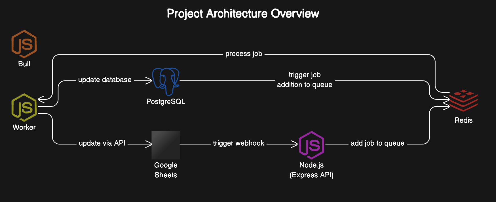

[](https://classroom.github.com/a/e0mOS4g_)
# Superjoin Hiring Assignment

### Welcome to Superjoin's hiring assignment! 🚀

### Objective
Build a solution that enables real-time synchronization of data between a Google Sheet and a specified database (e.g., MySQL, PostgreSQL). The solution should detect changes in the Google Sheet and update the database accordingly, and vice versa.

### Problem Statement
Many businesses use Google Sheets for collaborative data management and databases for more robust and scalable data storage. However, keeping the data synchronised between Google Sheets and databases is often a manual and error-prone process. Your task is to develop a solution that automates this synchronisation, ensuring that changes in one are reflected in the other in real-time.

### Requirements:
1. Real-time Synchronisation
  - Implement a system that detects changes in Google Sheets and updates the database accordingly.
   - Similarly, detect changes in the database and update the Google Sheet.
  2.	CRUD Operations
   - Ensure the system supports Create, Read, Update, and Delete operations for both Google Sheets and the database.
   - Maintain data consistency across both platforms.
   
### Optional Challenges (This is not mandatory):
1. Conflict Handling
- Develop a strategy to handle conflicts that may arise when changes are made simultaneously in both Google Sheets and the database.
- Provide options for conflict resolution (e.g., last write wins, user-defined rules).
    
2. Scalability: 	
- Ensure the solution can handle large datasets and high-frequency updates without performance degradation.
- Optimize for scalability and efficiency.

## Submission ⏰
The timeline for this submission is: **Next 2 days**

Some things you might want to take care of:
- Make use of git and commit your steps!
- Use good coding practices.
- Write beautiful and readable code. Well-written code is nothing less than a work of art.
- Use semantic variable naming.
- Your code should be organized well in files and folders which is easy to figure out.
- If there is something happening in your code that is not very intuitive, add some comments.
- Add to this README at the bottom explaining your approach (brownie points 😋)
- Use ChatGPT4o/o1/Github Co-pilot, anything that accelerates how you work 💪🏽. 

Make sure you finish the assignment a little earlier than this so you have time to make any final changes.

Once you're done, make sure you **record a video** showing your project working. The video should **NOT** be longer than 120 seconds. While you record the video, tell us about your biggest blocker, and how you overcame it! Don't be shy, talk us through, we'd love that.

We have a checklist at the bottom of this README file, which you should update as your progress with your assignment. It will help us evaluate your project.

- [✅] My code's working just fine! 🥳
- [✅] I have recorded a video showing it working and embedded it in the README ▶️
- [✅] I have tested all the normal working cases 😎
- [✅] I have even solved some edge cases (brownie points) 💪
- [✅] I added my very planned-out approach to the problem at the end of this README 📜

## Got Questions❓
Feel free to check the discussions tab, you might get some help there. Check out that tab before reaching out to us. Also, did you know, the internet is a great place to explore? 😛

We're available at techhiring@superjoin.ai for all queries. 

All the best ✨.

## Developer's Section
*Add your video here, and your approach to the problem (optional). Leave some comments for us here if you want, we will be reading this :)*

# Real-Time Google Sheets and PostgreSQL Synchronization

This project implements a robust, scalable system for real-time synchronization between Google Sheets and a PostgreSQL database. It ensures that any changes made in either system are automatically reflected in the other, providing a seamless integration between the two platforms.

## Table of Contents

1. [Architecture Overview](#architecture-overview)
2. [Core Components](#core-components)
3. [Flow of Data and Synchronization](#flow-of-data-and-synchronization)
4. [Handling Edge Cases](#handling-edge-cases)
5. [Queue System for Background Job Processing](#queue-system-for-background-job-processing)
6. [Error Handling and Resilience](#error-handling-and-resilience)
7. [Scalability and Extensibility](#scalability-and-extensibility)
8. [Handling Optional Challenges](#handling-optional-challenges)  
9. [Getting Started](#getting-started)
10. [Configuration](#configuration)
11. [API Endpoints](#api-endpoints)
12. [File Structure](#file-structure)
13. [A Fun Note to Superjoin](#a-fun-note-to-superjoin)

## Architecture Overview

The system is built using Node.js, Express, Redis (for queuing), and Bull (for job processing). It provides a seamless, bidirectional synchronization between Google Sheets and PostgreSQL, handling data validation, conflict resolution, and error management.

## Demo
Check out this demo video to see the project in action:

[](https://youtu.be/GTWGgBQXbA4)




*Figure 1: Project Architecture Diagram*

The architecture consists of the following key components:

1. **Google Sheets**: Acts as a front-end interface for user input.
2. **PostgreSQL**: Structured database for storing synchronized data.
3. **Redis**: In-memory data store used as the queue backend.
4. **Bull**: Job queue library built on Redis for managing synchronization tasks.
5. **Node.js (Express API)**: Main backend application handling API calls and job queuing.
6. **Worker**: Background process for executing synchronization jobs.

### Flow of Data and Synchronization

#### Google Sheets to PostgreSQL
1. Changes in Google Sheets trigger a webhook to the Express API.
2. API validates the data and adds a job to the Redis queue.
3. Worker processes the job and updates PostgreSQL.

#### PostgreSQL to Google Sheets
1. Changes in PostgreSQL trigger a job addition to the Redis queue.
2. Worker processes the job and updates Google Sheets via API.

This architecture ensures real-time, bidirectional synchronization between Google Sheets and PostgreSQL, with robust error handling and scalability.

## Handling Edge Cases

- **Conflict Resolution**: Implements strategies like "last write wins" or user-defined rules.
- **Data Validation**: Ensures data from Google Sheets conforms to PostgreSQL schema before insertion.

## Queue System for Background Job Processing

- Uses Redis and Bull for reliable, asynchronous job processing.
- Allows for horizontal scaling with multiple workers.

## Error Handling and Resilience

- Implements retry mechanisms for failed jobs.
- Logs errors for investigation and maintains system stability.

## Scalability and Extensibility

- Designed to scale both vertically and horizontally.
- Extensible architecture allows for adding new features or complex operations.

## Handling Optional Challenges

This project addresses the optional challenges of conflict handling and scalability, ensuring a robust and efficient synchronization system.

### Conflict Handling

To manage conflicts that may arise when changes are made simultaneously in both Google Sheets and the database, we implemented the following strategies:


1. **Queuing System**:
   - All synchronization operations are processed through a Redis-backed Bull queue.
   - This queuing system helps to serialize operations, reducing the likelihood of conflicts.

2. **Transactional Operations**:
   - Database operations are wrapped in transactions (as seen in `dbController.js`).
   - This ensures that complex operations are atomic, maintaining data consistency.

3. **Error Handling and Rollback**:
   - If an error occurs during synchronization, the system is designed to rollback changes.
   - This prevents partial updates and maintains data integrity across both systems.

### Scalability

The project is optimized for scalability and efficiency to handle large datasets and high-frequency updates:

1. **Asynchronous Processing**:
   - The use of Bull queues allows for asynchronous processing of synchronization tasks.
   - This prevents long-running operations from blocking the main application thread.

2. **Distributed Architecture**:
   - The system is containerized using Docker, allowing for easy horizontal scaling.
   - Multiple instances of the application and worker processes can be deployed to handle increased load.

3. **Efficient Database Queries**:
   - Database operations are optimized to use efficient querying techniques.
   - Indexes are used on frequently queried columns to improve performance.

4. **Caching**:
   - Redis, while primarily used for queuing, can also be leveraged for caching frequently accessed data.
   - This reduces the load on the database and improves response times.

5. **Batched Operations**:
   - For large datasets, the system can be easily modified to use batched operations.
   - This would allow for efficient processing of bulk updates to both Google Sheets and the database.

6. **Monitoring and Logging**:
   - The system includes error logging and can be easily extended with monitoring tools.
   - This allows for proactive identification and resolution of performance bottlenecks.

By implementing these strategies, the project is well-equipped to handle the challenges of conflict resolution and scalability, providing a robust solution for real-time synchronization between Google Sheets and PostgreSQL.


## Getting Started

### Prerequisites

- Docker and Docker Compose
- Google Cloud Platform account with Sheets API enabled
- ngrok (for exposing local server to the internet)

### Installation and Setup

1. Clone the repository:
   ```
   git clone https://github.com/StackItHQ/vit-gincode18
   cd vit-gincode18
   ```

2. Set up environment variables (see [Configuration](#configuration)).

3. Start the application using Docker Compose:
   ```
   docker-compose up -d
   ```

   This command will build and start all the necessary containers (Node.js app, PostgreSQL, and Redis) in detached mode.

4. The application should now be running and accessible at `http://localhost:3000`.

5. To make your local server accessible from the internet (necessary for Google Sheets triggers), use ngrok:

   a. Install ngrok if you haven't already: https://ngrok.com/download

   b. Run ngrok to expose your local server:
   ```
   ngrok http 3000
   ```

   c. ngrok will provide a public URL (e.g., `https://1234abcd.ngrok.io`). Use this URL in your Google Apps Script trigger instead of `http://localhost:3000`.

   **Important:** Remember to update your Google Apps Script with the new ngrok URL each time you restart ngrok, as the URL changes with each session.

6. Set up the Google Apps Script trigger in your Google Sheet:
   - In your Google Sheet, go to Tools > Script editor
   - Create a new file named `Code.gs` (if it doesn't exist already)
   - Copy and paste the following code into `Code.gs`:

     ```javascript:setup/Code.gs
     function mytrigger(e) {
       const sheet = e.source.getActiveSheet();
       const editedRange = e.range;
       const lastRow = sheet.getLastRow();
       
       // Capture data from the entire sheet
       const sheetData = sheet.getRange(1, 1, lastRow, sheet.getLastColumn()).getValues();

       const payload = {
         range: {
           startRow: editedRange.getRow(),
           endRow: editedRange.getLastRow(),
         },
         sheetData: sheetData,
       };

       Logger.log("Payload: " + JSON.stringify(payload));  // Log the payload

       const url = 'https://your-ngrok-url.ngrok-free.app/api/sheets/sheet-trigger';
       const options = {
         method: 'POST',
         contentType: 'application/json',
         payload: JSON.stringify(payload)
       };

       try {
         const response = UrlFetchApp.fetch(url, options);
         Logger.log("Response Code: " + response.getResponseCode());  // Log the HTTP response code
         Logger.log("Response Body: " + response.getContentText());   // Log the response body
       } catch (error) {
         Logger.log("Error: " + error.message);  // Log any errors that occur during the request
       }
     }
     ```

   - Replace `'https://your-ngrok-url.ngrok-free.app'` with your actual ngrok URL
   - Set up a trigger for this function:
     - In the Apps Script editor, go to Edit > Current project's triggers
     - Click "Add Trigger"
     - Choose the following settings:
       - Choose which function to run: `mytrigger`
       - Choose which deployment should run: `Head`
       - Select event source: `From spreadsheet`
       - Select event type: `On edit`
     - Click "Save"

This script will send the entire sheet data to your API endpoint whenever an edit is made to the sheet. It also includes error logging to help with debugging.

Remember to update the `url` in the script whenever your ngrok URL changes.

## Database Schema

The PostgreSQL database is initialized with the following schema:

```sql
CREATE TABLE IF NOT EXISTS users (
    id SERIAL PRIMARY KEY,
    name VARCHAR(100),
    age INTEGER,
    city VARCHAR(100)
);
```

This table structure is defined in the `setup/init.sql` file, which is executed when the PostgreSQL container is first created. The schema includes:

- `id`: A unique identifier for each user (auto-incrementing)
- `name`: The user's name (up to 100 characters)
- `age`: The user's age (integer)
- `city`: The user's city (up to 100 characters)

Additionally, the initialization script sets up a trigger that notifies the application of any changes (INSERT, UPDATE, DELETE) to the `users` table, facilitating real-time synchronization with Google Sheets.

## Configuration

### Environment Variables

Create a `.env` file in the root directory with the following variables:

```
PORT="3000"
SHEET_ID="1BMEcK8WWPI3OTLqehEqVerYwA6RuvJMJvBtW5Euk5sM"
DB_USER="postgres"
DB_HOST="postgres"
DB_NAME="mydatabase"
DB_PASS="mysecretpassword"
DB_PORT="5432"
REDIS_URL="redis://redis:6379"
SHEET_RANGE="Sheet1!A1:D"
```

### Google Sheets API Credentials

To authenticate with the Google Sheets API, you need to provide a `credentials.json` file. Follow these steps to obtain and set up the credentials:

1. Go to the [Google Cloud Console](https://console.cloud.google.com/).
2. Create a new project or select an existing one.
3. Enable the Google Sheets API for your project.
4. Go to the "Credentials" section and create a new OAuth 2.0 Client ID.
5. Choose "Desktop app" as the application type.
6. Download the client configuration file and rename it to `credentials.json`.
7. Place the `credentials.json` file in the root directory of the project.

The `credentials.json` file should look similar to this:

```json
{
  "installed": {
    "client_id": "YOUR_CLIENT_ID",
    "project_id": "YOUR_PROJECT_ID",
    "auth_uri": "https://accounts.google.com/o/oauth2/auth",
    "token_uri": "https://oauth2.googleapis.com/token",
    "auth_provider_x509_cert_url": "https://www.googleapis.com/oauth2/v1/certs",
    "client_secret": "YOUR_CLIENT_SECRET",
    "redirect_uris": ["urn:ietf:wg:oauth:2.0:oob", "http://localhost"]
  }
}
```

Make sure to keep your `credentials.json` file secure and never commit it to version control. Add it to your `.gitignore` file to prevent accidental commits.

**Note:** When running the application for the first time, you'll need to authorize it to access your Google Sheets. The application will provide a URL for you to visit and complete the authorization process.


## API Endpoints

The application provides two sets of CRUD (Create, Read, Update, Delete) operation APIs: one for the PostgreSQL database and another for Google Sheets.

### Database API Endpoints

These endpoints interact directly with the PostgreSQL database.

- **Create**: `POST /api/db/`
  - Creates a new record in the database.
  - Request body should contain the data to be inserted.

- **Read**: `GET /api/db/`
  - Retrieves all records from the database.

- **Update**: `PUT /api/db/`
  - Updates an existing record in the database.
  - Request body should contain the updated data and identifier.

- **Delete**: `DELETE /api/db/`
  - Deletes a record from the database.
  - Request body should contain the identifier of the record to be deleted.

### Google Sheets API Endpoints

These endpoints interact with the Google Sheet.

- **Create**: `POST /api/sheets/`
  - Adds a new row to the Google Sheet.
  - Request body should contain the data to be added.

- **Read**: `GET /api/sheets/`
  - Retrieves all rows from the Google Sheet.

- **Update**: `PUT /api/sheets/`
  - Updates an existing row in the Google Sheet.
  - Request body should contain the updated data and row identifier.

- **Delete**: `DELETE /api/sheets/`
  - Deletes a row from the Google Sheet.
  - Request body should contain the identifier of the row to be deleted.

- **Sync**: `POST /api/sheets/sheet-trigger`
  - Triggers a synchronization from Google Sheets to the database.
  - This endpoint is typically called by a Google Apps Script trigger when changes are made to the sheet.

### Note on Synchronization

Changes made through these APIs will automatically trigger synchronization between the database and Google Sheets. The synchronization is handled by background jobs using Redis and Bull, ensuring real-time data consistency across both platforms.

## File Structure

The project follows a modular structure to ensure maintainability and scalability. Here's an overview of the main directories and files:

```
project-root/
│
├── config/
│   ├── dbConfig.js             # PostgreSQL database configuration
│   ├── googleSheetConfig.js    # Google Sheets API configuration
│   └── queueConfig.js          # Redis and Bull queue configuration
│
├── controllers/
│   ├── dbController.js         # Controllers for database operations
│   └── googleSheetController.js # Controllers for Google Sheets operations
│
├── routes/
│   ├── dbRoutes.js             # Express routes for database operations
│   └── googleSheetRoutes.js    # Express routes for Google Sheets operations
│
├── services/
│   ├── dbServices.js           # Database service functions
│   └── googleSheetServices.js  # Google Sheets service functions
│
├── setup/
│   ├── init.sql                # SQL script for initializing the database
│   └── Code.gs                 # Google Apps Script for sheet trigger
│
├── sync/
│   ├── notificationListener.js # Listens for changes in PostgreSQL and triggers syncs
│   ├── queueProducers.js       # Functions to add jobs to the queues
│   └── syncWorker.js           # Worker for processing sync jobs
│
├── .env                        # Environment variables
├── .env.example                # Example environment variables file
├── credentials.json            # Google Sheets API credentials
├── docker-compose.yml          # Docker Compose configuration
├── Dockerfile                  # Dockerfile for containerization
├── index.js                    # Main application entry point
├── package.json                # Node.js project configuration
└── README.md                   # Project documentation
```

### Directory Explanations

- **config/**: Contains configuration files for different parts of the application.
  - `dbConfig.js`: Sets up the PostgreSQL connection pool.
  - `googleSheetConfig.js`: Configures the Google Sheets API client.
  - `queueConfig.js`: Sets up Redis connection and Bull queues.

- **controllers/**: Houses the controller functions that handle the logic for API endpoints.
  - `dbController.js`: Controllers for database CRUD operations.
  - `googleSheetController.js`: Controllers for Google Sheets CRUD operations.

- **routes/**: Defines the API routes for the application.
  - `dbRoutes.js`: Express routes for database operations.
  - `googleSheetRoutes.js`: Express routes for Google Sheets operations.

- **services/**: Contains the core business logic and data manipulation functions.
  - `dbServices.js`: Functions for interacting with the PostgreSQL database.
  - `googleSheetServices.js`: Functions for interacting with Google Sheets.

- **setup/**: Contains setup-related files.
  - `init.sql`: SQL script for initializing the PostgreSQL database.
  - `Code.gs`: Google Apps Script for setting up the sheet trigger.

- **sync/**: Includes files related to the synchronization process.
  - `notificationListener.js`: Listens for changes in PostgreSQL and triggers syncs.
  - `queueProducers.js`: Functions to add synchronization jobs to the queues.
  - `syncWorker.js`: Processes synchronization jobs from the queues.

- **.env**: Contains environment variables for configuration.
- **.env.example**: Example file showing the required environment variables.
- **credentials.json**: Contains the Google Sheets API credentials for authentication.
- **docker-compose.yml**: Defines and configures the Docker services for the application.
- **Dockerfile**: Instructions for building the Docker container for the application.
- **index.js**: The main entry point of the application, sets up the Express server and initializes various components.
- **package.json**: Defines the project dependencies and scripts.

This structure separates concerns, making it easier to maintain

## A Fun Note to Superjoin

Hey Superjoin team! 👋

Wow, what a ride this assignment has been! 🎢 I've got to say, syncing Google Sheets and PostgreSQL in real-time was like trying to teach my cat to fetch – challenging, but oh so rewarding when it finally worked! 😺

This task was more fun than a barrel of monkeys 🐒 (or should I say, a spreadsheet of data?). I found myself doing the "debug dance" 💃 more times than I'd like to admit, but each successful sync felt like scoring a touchdown in the Super Bowl of coding! 🏈

I've learned so much, from wrangling with Google's API (which felt like solving a Rubik's cube blindfolded 🧊) to making PostgreSQL and Google Sheets play nice together (like getting cats and dogs to have a tea party ☕️).

Thank you for this fantastic opportunity to flex my coding muscles 💪 and dive deep into the world of real-time data synchronization. It was a blast, and I hope my solution brings a smile to your faces as you review it! 😄

Looking forward to potentially joining the Superjoin team and tackling even more exciting challenges together! 🚀

Cheers,
Vishal

P.S. If my synchronization works perfectly, I'll consider changing my middle name to "Real-Time"! ⏱️😄